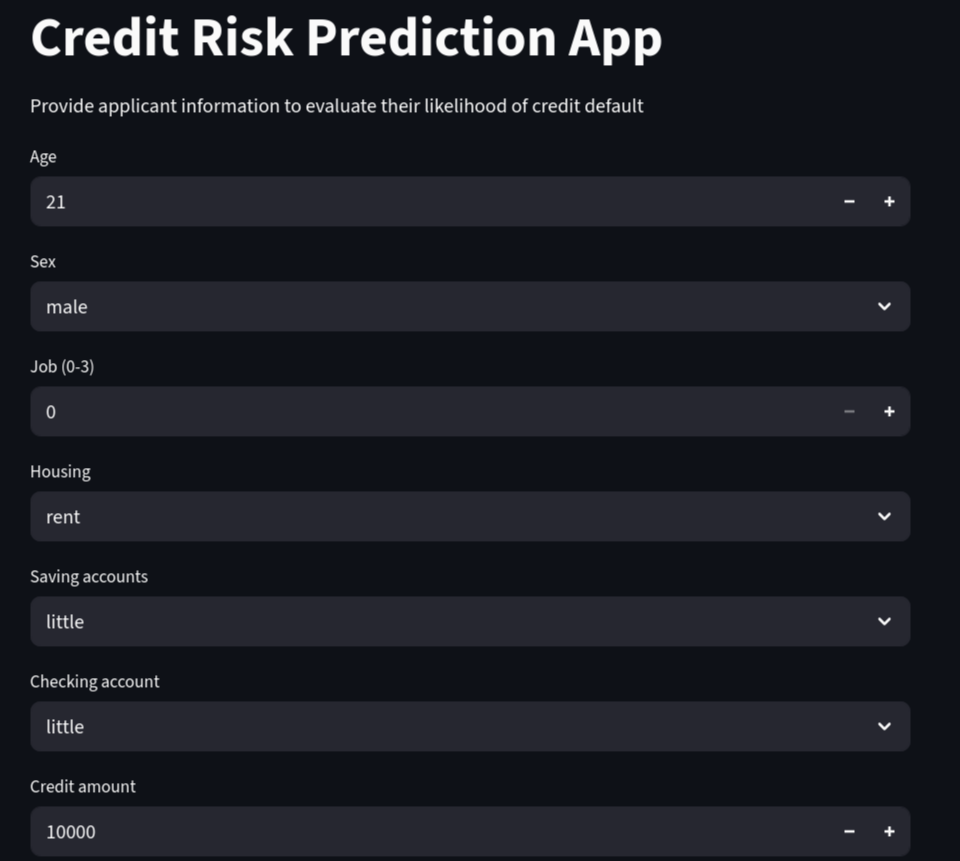

Credit Risk Prediction App

This app predicts whether a loan applicant is at risk of defaulting.  
Built with Python, Streamlit, and Machine Learning.

Features
- Predict credit risk based on user input
- Simple, interactive interface
- Visualizes risk probabilities

Tech Stack
- Python
- Streamlit
- Scikit-learn
- Pandas, NumPy

- 

